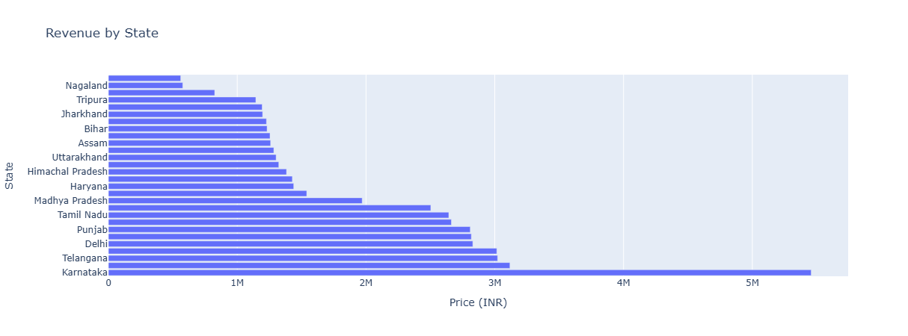
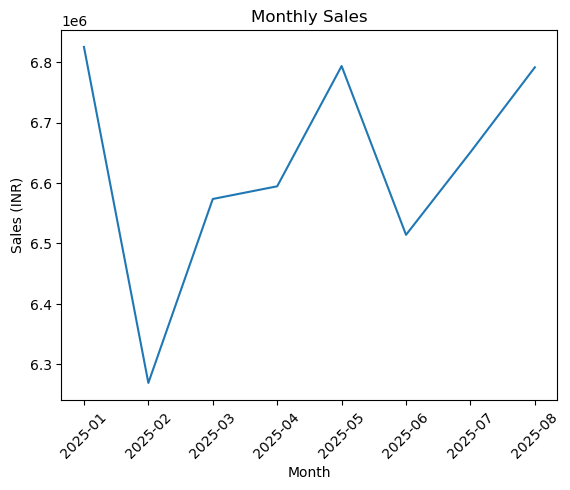
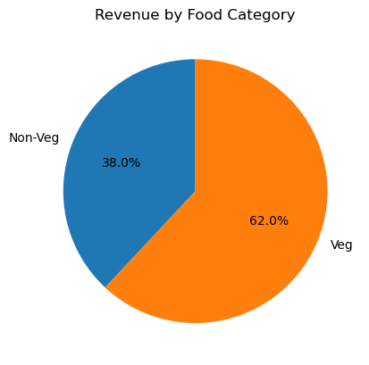

 🍔 Swiggy Data Analysis

 📌 Project Overview

This project performs exploratory data analysis on Swiggy order data using Python. The analysis focuses on understanding sales performance, customer ratings, order value, food categories, geographical sales distribution, and sales trends over different time periods.

The analysis is performed using **Pandas, NumPy, Matplotlib, Seaborn, and Plotly**.

🎯 Objectives

The main objectives of this project are:

* Analyze overall sales performance
* Calculate average customer rating
* Calculate average order value
* Analyze rating count
* Study monthly and daily sales trends
* Compare Veg and Non-Veg sales
* Analyze revenue by state
* Prepare a quarterly sales summary
* Identify the top 5 cities by sales
* Analyze weekly sales trends

 🛠️ Tools & Technologies

* **Python**
* **Pandas** — Data manipulation and analysis
* **NumPy** — Numerical operations
* **Matplotlib** — Data visualization
* **Seaborn** — Statistical visualization
* **Plotly** — Interactive visualizations
* **Jupyter Notebook**

 📂 Project Files

| File                                  | Description                                            |
| ------------------------------------- | ------------------------------------------------------ |
| `Swiggy_Sales_Analysis_Project.ipynb` | Jupyter Notebook containing the complete data analysis |
| `Swiggy Data.xlxs`                       | Dataset used for the analysis                          |

## 📊 Analysis Performed

### 1. Overall Sales Analysis

Calculated the total sales generated from the dataset.

### 2. Average Rating

Calculated the average rating given by customers.

### 3. Average Order Value

Calculated the average value of an order using the `Price (INR)` column.

### 4. Rating Count

Analyzed the number of customer ratings available in the dataset.

### 5. Monthly Sales

Analyzed sales performance month-wise to understand changes in revenue over time.

### 6. Daily Sales

Analyzed the daily sales pattern using order dates.

### 7. Veg vs Non-Veg Sales

Categorized dishes into **Veg** and **Non-Veg** based on dish names and compared their sales.

### 8. Sales by State

Analyzed revenue generated across different states.

### 9. Quarterly Summary

Created a quarterly summary containing:

* Total Sales
* Average Rating
* Total Orders

### 10. Top 5 Cities by Sales

Identified the five cities generating the highest sales.

### 11. Weekly Sales Trend

Analyzed sales trends on a week-by-week basis.

## 📈 Key Visualizations

The project includes visualizations for:

* Monthly Sales
* Daily Sales
* Veg vs Non-Veg Sales
* Revenue by State
* Quarterly Sales Summary
* Top 5 Cities by Sales
* Weekly Sales Trend

## 🔍 Key Skills Demonstrated

Through this project, I practiced:

* Data Cleaning
* Data Transformation
* Exploratory Data Analysis (EDA)
* GroupBy Operations
* Date & Time Analysis
* Aggregation
* Feature Creation
* Data Visualization
* Business-oriented Data Analysis

## 📊 Project Visualizations

### Revenue by State

### Top 5 Cities by Sales

### Sales Analysis

### Sales By Food Category(Veg or Non-Veg)

## 🚀 Conclusion

This project demonstrates the use of Python-based data analysis techniques to explore Swiggy sales data and identify meaningful patterns across time, food categories, states, and cities.

The analysis provides a structured view of sales performance and demonstrates how data can be transformed into useful business insights.

## 👨‍💻 Author

**Lovekesh**

B.Tech Computer Science & Engineering

---

